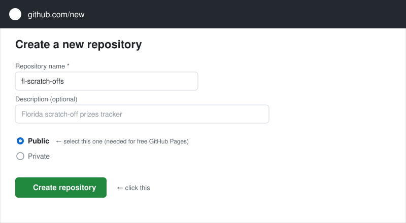
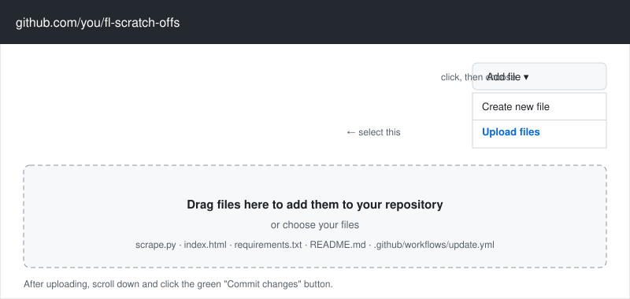
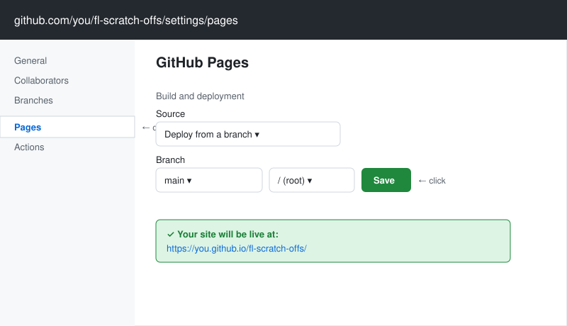
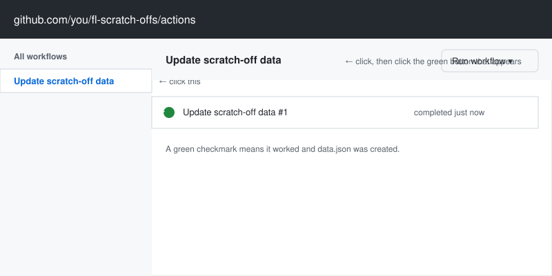
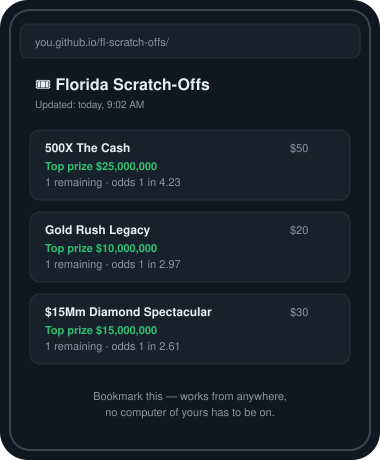

# Florida Scratch-Offs — Prizes Remaining

A tiny site showing which Florida Lottery scratch-off games still have
top prizes left, sorted by best odds. Data comes from lottery.net, a
public aggregator of the official Florida Lottery figures (updated weekly).

## What's here
- `scrape.py` — pulls the data table and saves it to `data.json`
- `index.html` — mobile-friendly page that reads `data.json`
- `.github/workflows/update.yml` — re-runs the scraper every day and
  publishes the result automatically

## Get it live in 5 minutes (no server needed)

This whole thing runs for free on GitHub's servers — nothing needs to
stay on or plugged in at your house. You do this setup once, then just
visit a URL from your phone whenever you want.

If you don't already have a GitHub account, make one free at
[github.com/join](https://github.com/join) first — it's just an email
and a password.

### Step 1 — Create a repo and upload the files

A "repo" (repository) is just a folder for your project that lives on
GitHub. Go to [github.com/new](https://github.com/new), type a name
like `fl-scratch-offs`, make sure **Public** is selected (Pages hosting
is free only for public repos), and click **Create repository**.



You'll land on an empty repo page. Click **Add file → Upload files**,
then drag in all five files/folders you got from this project
(`scrape.py`, `index.html`, `requirements.txt`, `README.md`, and the
whole `.github` folder — including the `workflows` folder inside it,
since that's what makes the automatic daily updates work). Scroll down
and click the green **Commit changes** button to save them.



### Step 2 — Turn on GitHub Pages

This tells GitHub "host this as a website." In your repo, click
**Settings** (top menu), then **Pages** in the left sidebar. Under
"Build and deployment," set:
- **Source**: `Deploy from a branch`
- **Branch**: `main`, folder `/ (root)`

Click **Save**. GitHub will show you the URL your site will live at.



### Step 3 — Run the scraper once, manually

The daily automatic run won't happen until tomorrow, so kick it off
by hand the first time to create `data.json` right away. Click the
**Actions** tab, click **Update scratch-off data** in the left list,
then click the **Run workflow** dropdown on the right and click the
green button that appears inside it. Wait about 20–30 seconds and
refresh — a green checkmark means it worked.



### Step 4 — Bookmark your live page

Your page is now live at:
`https://<your-username>.github.io/<repo-name>/`

(GitHub shows you this exact URL on the Pages settings screen from
step 2.) Open it on your phone and bookmark it, or add it to your home
screen. From here on, the Actions workflow re-runs automatically every
day and updates the page — you never have to repeat any of this.



## Running it locally instead

```
pip install -r requirements.txt
python3 scrape.py        # creates data.json
python3 -m http.server    # then open http://localhost:8000
```

## Notes
- This pulls from a third-party aggregator, not flalottery.com directly,
  because the official site's remaining-prizes table is loaded via
  JavaScript and its raw data file is excluded from automated access
  by the site's robots.txt. lottery.net's data is sourced from the same
  official figures but may lag by up to a week.
- If lottery.net changes its page layout, `scrape.py` may need its
  table-parsing logic updated — it looks for the first `<table>` on
  the page.
